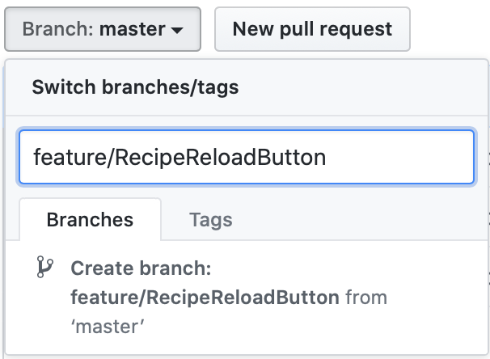
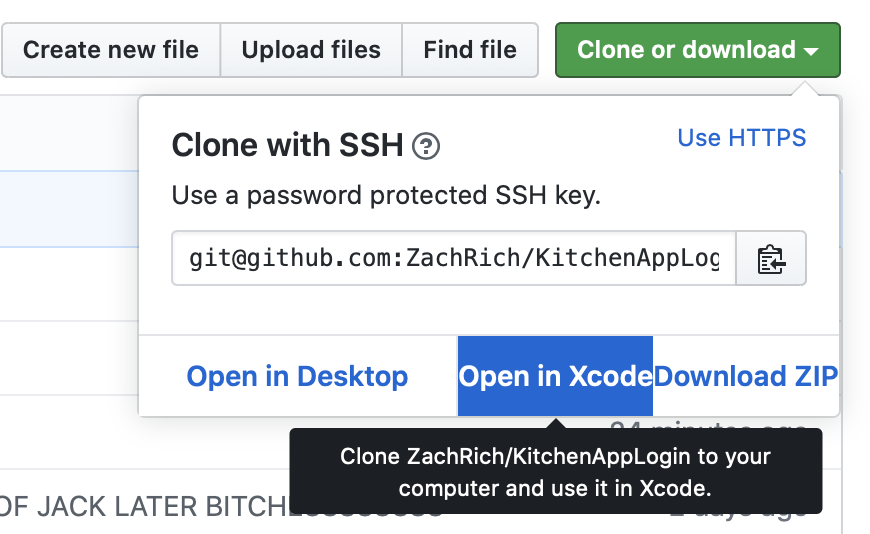
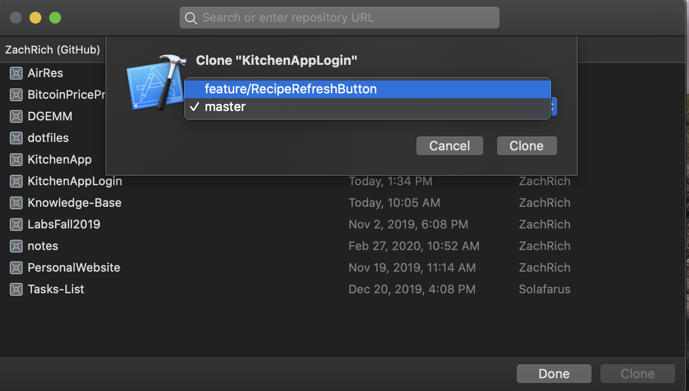

# Add a new Feature to project workflow
---
### Requirements
1. A github Account
2. A project you want to contribute to
3. Github integrated into your IDE of choice

### WorkFlow

1. Create a new branch from master.

2. Clone the new branch

3. Save the branch on local machine

4. Edit the code and make changes

5. Once done. Commit the files you've changed, and write a descriptive commit message describing the changes you've made.

6. Push your changes the the remote repository[Your branch] (Note: You should never commit directly to the master branch, as 
this is your working copy and should always stay functional at all times.)
7. Go to github, and navigate to pull requests.

8. Merge your branch with the master branch.

